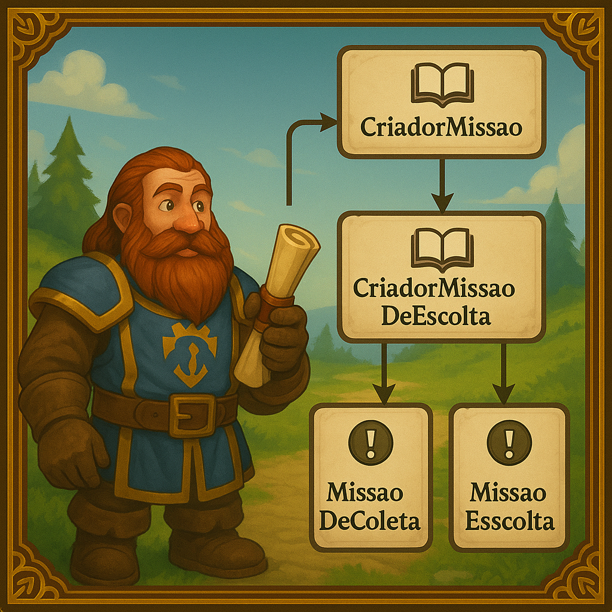

# Padrão de Projeto: Factory Method com Analogia de World of Warcraft

Este projeto demonstra a implementação do padrão de projeto **Factory Method** em Java, utilizando uma analogia com o universo de World of Warcraft para a criação de diferentes tipos de missões.

## Estrutura do Projeto

O código está organizado no pacote `missao` e contém as seguintes classes e interfaces:

- `Missao.java`: Interface que define o contrato para todas as missões (Produto).
- `MissaoDeCombate.java`, `MissaoDeColeta.java`, `MissaoDeEscolta.java`: Implementações concretas da interface `Missao` (Produtos Concretos).
- `CriadorDeMissao.java`: Classe abstrata que define o Factory Method `criarMissao()` (Criador Abstrato).
- `CriadorMissaoCombate.java`, `CriadorMissaoColeta.java`, `CriadorMissaoEscolta.java`: Implementações concretas de `CriadorDeMissao`, responsáveis por criar tipos específicos de missões (Criadores Concretos).
- `Game.java`: Classe principal que demonstra o uso do padrão Factory Method para criar e interagir com as missões (Cliente).

## Como Compilar e Executar

Para compilar e executar este projeto, siga os passos abaixo:

### Pré-requisitos

- Java Development Kit (JDK) 8 ou superior instalado.

### Compilação

Navegue até o diretório `src` do projeto no seu terminal e compile os arquivos Java. Se você estiver no diretório raiz do projeto (`wow-missao-factory-method`), pode usar o seguinte comando:

```bash
javac src/missao/*.java -d bin
```

Este comando compilará todos os arquivos `.java` dentro do pacote `missao` e colocará os arquivos `.class` resultantes no diretório `bin`.

### Execução

Após a compilação, você pode executar a classe principal `Game` a partir do diretório raiz do projeto:

```bash
java -cp bin missao.Game
```

### Exemplo de Saída

Ao executar o programa, você verá uma saída similar a esta, demonstrando a criação e execução de diferentes tipos de missões:

```
--- Missão 1 ---
Um novo pergaminho de missão apareceu!
Objetivo da Missão: Colete 10 Ervas do Sol para o alquimista.
Recompensa: Ótimo trabalho! Aqui estão 50 moedas de ouro.

======================================

--- Missão 2 ---
Um novo pergaminho de missão apareceu!
Objetivo da Missão: Escolte o Garrosh em segurança até a próxima cidade.
Recompensa: Missão concluída! Sua reputação com o reino aumentou.
```

### Artigo disponível em:
https://www.jcsalerno.com.br/blog/2025/07/23/criando-missoes-em-azeroth-com-o-padrao-factory-method/




